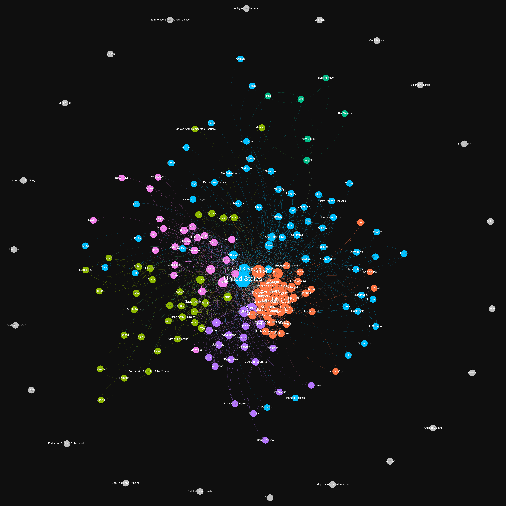

# WikiMapper

Create maps of wiki links on how they interconnect with each other.

_Connections are a score of number of direct and indirect links from one link to another through the wikipedia article._

## Example maps



## How to use

1. Give wikipedia links whose connections you want to measure as input to the python script in a file. Find usage info for the script in Working section.
1. The script generates edge-list csv files for the links with weights on how strong the connections are between the links.
1. Import the edge-list csv files into a data visualization tool like [Gephi](https://gephi.org/)
1. In Gephi, you can apply layout algorithms to visualize the inter-connections. Apply Modularity Analysis to partition data into groups. Make tweaks to make the data look apealing.

## Working

- The python script uses the library [BeautifulSoup](https://www.crummy.com/software/BeautifulSoup/bs4/doc/) to parse the wikipedia pages to extract links and titles. The requirements can be downloaded with pipenv using `pipenv install`.
- The links are parsed in a breadth-first manner for each input link.
- Connection score is calculated as `1/depth` for every time an input link is reached.
- Multiprocessing and caching is used to speed up the parsing process.
- For each input link a csv file will be dumped in the output directory as Source, Target, Weight/Score of the connection.

```
usage: main.py [-h] [-i INPUT] [-d DEPTH] [-o OUTPUT] [-j JOBS]

Generate csv of wiki links connection with weights based on number of direct/indirect connections between them.

optional arguments:
  -h, --help            show this help message and exit
  -i INPUT, --input INPUT
                        path to file with links
  -d DEPTH, --depth DEPTH
                        maximum depth that should be parsed
  -o OUTPUT, --output OUTPUT
                        output directory to store the csv files
  -j JOBS, --jobs JOBS  Number of processes to spawn for parallel processing. Default is cpu_count*2
```

# Contributing

If you see any possible improvements, feel free to raise a PR or an issue. Leave a star if you liked the project :)


This project was largely inspired from [Kiran Gershenfeld](https://github.com/KiranGershenfeld)'s twitch community graphs [project](https://github.com/KiranGershenfeld/VisualizingTwitchCommunities). Check it out!