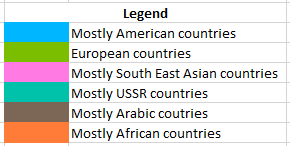

## Map generated for countries of the world

[Alternate link for image](https://postimg.cc/ftQCyrf0)

The list of countries were taken from https://en.wikipedia.org/wiki/List_of_sovereign_states.

The list can be found in [country_links.txt](country_links.txt), image file in [countries_map.png](countries_map.png) and svg version [countries_map.svg](countries_map.svg).

## What am I looking at?
Each node is country, the size is determined by the total weight of to and fro connections.
Connections and its thickness is determined by the number of direct and indirect links. (More details in the main code README)
Colors for the countries were algorithmically determined based on the connections.

## How was it created?
The map data was generated using code with depth 2 and country_links.txt as input. The map image was created with a tool called [Gephi](https://gephi.org/).
All countries seem to have a link with each other which messes up the layout in Gephi, so a small weighted edge threshold filter was added during creation.
The colors/partitions in the map was created by running Modularity Analysis in Gephi.

## Analysis
_Disclaimer: I am not a data scientist. Whatever I say is just a crude visual interpretation. If you are a qualified professional, I can help you out if needed to derive better results and understanding. Thank you!_

- United States has highest total in and out connection score. This is followed by France, Italy, United Kingdom, Russia, China, Germany, Spain, Turkey and Switzerland.
- However, the total number of in and out connection is highest for France. Followed by United States, China, United Kingdon and Russia.
- Countries closer geographically tend to be closer to each other in the map too. The grouping of the countries seem to follow this rule too.
- Every country has a connection with each other in the raw data. This is because of links to list of countries or ranking of countries in wikipedia. So a small threshold was added to filter connections.
